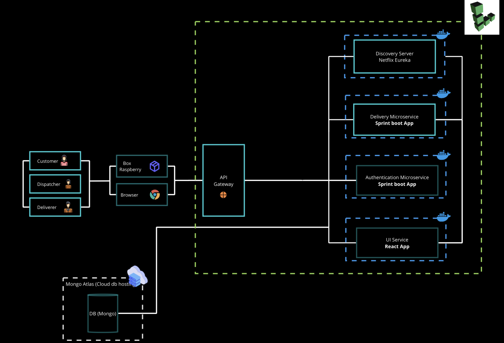
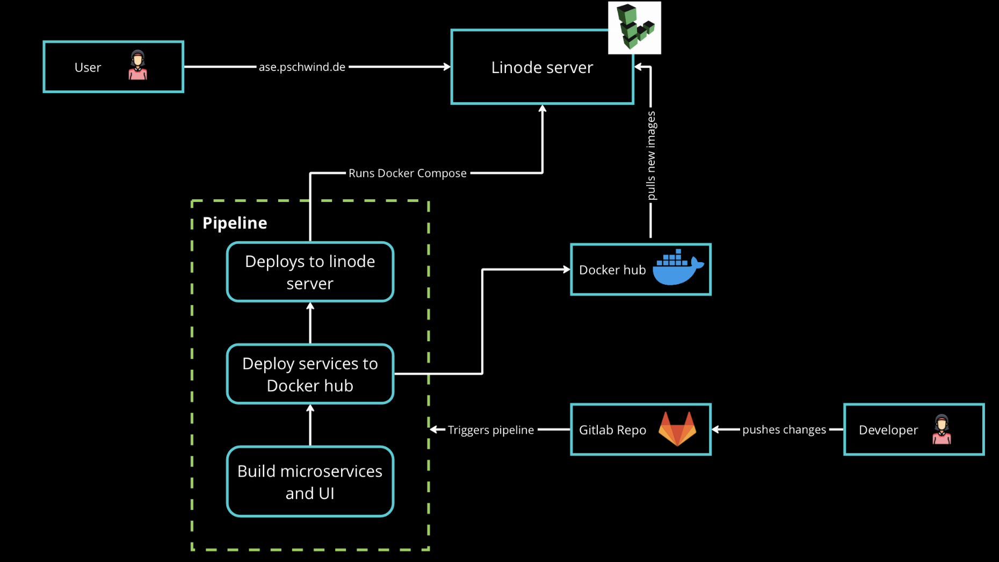

# ASE delivery system
Team: 40

In this repository is code of the delivery system implemented for the lecture Advanced topics of software engineering. 
To test and play around with the latest version of our application please visit:
### - https://ase.pschwind.de

Readme structure:
1. Overview
2. Quick start
4. Cloud hosting
3. Pipeline

## Overview
### Architecture

### Requirements
Please make sure you have the following Requirements already installed on your computer before attempting to run the application:
- Docker
## Quick start
In order to run the application in production setting locally, execute the following command:
- `docker-compose up -d`  

In order to run the application in development mode with Docker, execute the following command:
- `docker-compose -f docker-compose.test.yml up -d`
## Cloud hosting
### Mongo Atlas
Our mongo database is hosted in [Mongodb atlas](https://www.mongodb.com/atlas/database)
### Linode
All of our microservices and react app are running on [Linode cloud hosting service](https://www.linode.com)
Our Linode server has 4 CPU Cores and 8GB RAM. It is located in Frankfurt Germany.
## Pipeline

Our pipeline runs as follows:
1. at the build stage, the `build` job runs a clean build on all of our spring boot microservices. This job only runs if changes were detected in our microservices folder. This is also the only job that runs in feature branches and not just on the main branch.
2. at the docker-frontend stage, the `docker-frontend` job builds the frontend image and pushes it to docker hub. This job will only run when changes are detected on the main branch.
3. at the docker-backend stage, the `docker-backend` job uses jib to build the backend images and pushes them to Docker hub. This job will only run when changes are detected on the main branch.
4. at the deploy stage, the `deploy` job copies the latest version of our docker-compose file to our Linode server and then runs `docker compose up -d` on our server using ssh. the docker compose file will pull all latest images from docker hub and run them thus having all of our latest changes live.
